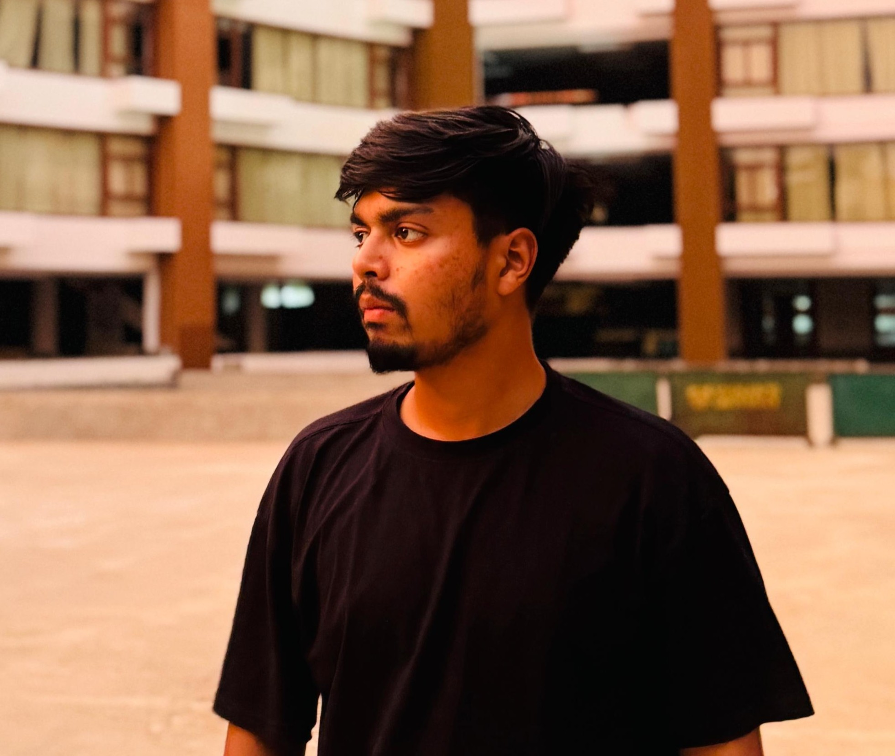

# 💼 Raiyan Aziz - Digital Resume

A clean, responsive, and professional **HTML + CSS resume** built to showcase my skills, experience, projects, and certifications.

## 🔥 Features

- ✅ Responsive design with elegant styling
- ✅ Skills in Python, Java, Web Development, AI & ML
- ✅ Internship and leadership experience
- ✅ Real-world project highlights
- ✅ Custom sections for education, languages, and contact

## 🖼️ Preview

## 📁 Files Included

- `index.html` – Main HTML structure of the resume  
- `Raiyan_CV.css` – Custom CSS styles for a modern look  
- `ra.jpg` – Profile photo (replaceable with your own)

## 🚀 How to Use

1. Clone or download this repository
2. Open `index.html` in your browser
3. Customize content and styles as needed
4. Deploy using GitHub Pages, Netlify, or any static host

## 🌐 Live Links

- 🔗 [LinkedIn](https://www.linkedin.com/in/raiyan-aziz-8403b9311)  
- 🔗 [GitHub](https://github.com/raiYan15)

## 📧 Contact

Feel free to connect or collaborate: **Raiyan**

---

> ⚡ Built with passion for tech, design, and clean code. Ready to be customized and reused!

